# 👋 Hi, I'm Jitender Chauhan 
### aka **Mr. J** 

<div align="center">
  
[](https://git.io/typing-svg)

</div>

```ascii
 ███▄ ▄███▓ ██▀███      ▄▄▄██▀▀▀
▓██▒▀█▀ ██▒▓██ ▒ ██▒      ▒██   
▓██    ▓██░▓██ ░▄█ ▒      ░██  
▒██    ▒██ ▒██▀▀█▄     ▓██▄██▓
▒██▒   ░██▒░██▓ ▒██▒    ▓███▒  
░ ▒░   ░  ░░ ▒▓ ░▒▓░    ▒▓▒▒░  
```

<div align="center">

[](your-portfolio-url-here)
[](https://linkedin.com/in/yourusername)
[](mailto:your.email@example.com)
[](https://instagram.com/yourusername)

</div>

---

## 🚀 About Me

```python
class JitenderChauhan:
    def __init__(self):
        self.name = "Jitender Chauhan"
        self.alias = "Mr. J"
        self.location = "Kullu, Himachal Pradesh, India 🏔️"
        self.education = {
            "degree": "BCA (Bachelor of Computer Applications)",
            "specialization": "Artificial Intelligence & Machine Learning",
            "university": "Shoolini University",
            "status": "Advanced Undergraduate"
        }
        self.current_focus = [
            "AI/ML Development",
            "Full Stack Web Development",
            "Building Innovative Solutions"
        ]
        self.goals = {
            "short_term": "Master AI/ML & C#",
            "long_term": "Study in Japan/Taiwan, Work in AI Industry"
        }
        self.passion = "Building intelligent systems that solve real-world problems 🌟"
    
    def say_hi(self):
        print("Thanks for dropping by! Let's build something amazing together 🚀")

me = JitenderChauhan()
me.say_hi()
```

## 💻 Tech Stack

<div align="center">

### Languages


### Web Development


### AI/ML & Data


### Database & Tools


### Design


</div>

## 📊 GitHub Stats

<div align="center">


</div>

<div align="center">
  
[](https://github.com/ryo-ma/github-profile-trophy)

</div>

## 🏆 Achievements & Certifications

```yaml
Certifications:
  - name: "IBM Skills Build"
    topics: ["AI Fundamentals", "Professional Skills"]
    status: "Completed ✅"
  
  - name: "University Workshops"
    topics: ["Advanced CS", "Machine Learning"]
    status: "Active 🔄"

Skills_Mastered: 15+
Projects_Completed: 10+
Lines_of_Code: 50000+
Coffee_Consumed: ∞
```

## 🎯 Current Focus

```javascript
const currentlyWorkingOn = {
    learning: [
        "Advanced Machine Learning Algorithms",
        "Deep Learning & Neural Networks",
        "Full Stack Development with React",
        "C# & .NET Framework"
    ],
    building: [
        "AI-powered Student Management System",
        "ML Prediction Models",
        "Personal Portfolio Website (Terminal-themed)",
        "Creative Design Projects"
    ],
    reading: [
        "Hands-On Machine Learning with Scikit-Learn",
        "Clean Code by Robert C. Martin",
        "Fiction novels 📚"
    ],
    goals_2026: [
        "Build 5+ production-ready projects",
        "Contribute to open source",
        "Master AI/ML frameworks",
        "Prepare for international studies (Japan/Taiwan)"
    ]
};
```

## 🌟 Featured Projects

<div align="center">

[](https://github.com/yourusername/student-management)
[](https://github.com/yourusername/ml-projects)
[](https://github.com/yourusername/portfolio)

</div>

<details>
<summary><b>🚀 Project Details (Click to expand)</b></summary>

### 📦 Student Management System
**Full Stack Application** | MySQL + C# + Web
- ✅ Fee payment module with database integration
- ✅ Robust UI/Backend architecture
- ✅ Real-time data management
- 🛠️ Tech: MySQL, C#, Web Development

### 🤖 AI/ML Mini Projects
**Machine Learning Collection** | Python + TensorFlow
- ✅ Data analysis and prediction models
- ✅ Custom training pipelines
- ✅ Model evaluation frameworks
- 🛠️ Tech: Python, Pandas, Scikit-learn, TensorFlow

### 🎨 Design Portfolio
**Creative Works** | UI/UX Design
- ✅ Posters, wallpapers, branding concepts
- ✅ Website UI designs
- ✅ Visual storytelling
- 🛠️ Tech: Canva, Figma

</details>

## 💡 What I Bring to the Table

```bash
$ cat strengths.txt

⚡ Problem Solving      → Breaking complex problems into elegant solutions
🎨 Creative Thinking    → Unique approaches to technical challenges
📊 Data-Driven         → Making decisions based on analysis and metrics
🔄 Continuous Learning  → Always exploring new technologies
🎯 Precision           → Attention to detail in every line of code
🤝 Collaboration       → Team player with strong communication skills
```

## 🌱 Learning Journey

```mermaid
graph LR
    A[BCA Student] --> B[AI & ML Specialization]
    B --> C[Full Stack Developer]
    C --> D[AI Engineer]
    D --> E[International Career]
    E --> F[Tech Entrepreneur]
    
    style A fill:#00ff41,stroke:#00d9ff,stroke-width:2px,color:#000
    style B fill:#00ff41,stroke:#00d9ff,stroke-width:2px,color:#000
    style C fill:#00d9ff,stroke:#a855f7,stroke-width:2px,color:#000
    style D fill:#00d9ff,stroke:#a855f7,stroke-width:2px,color:#000
    style E fill:#a855f7,stroke:#ff0055,stroke-width:2px,color:#fff
    style F fill:#ffed4e,stroke:#ff0055,stroke-width:2px,color:#000
```

<div align="center">



</div>

## 🎮 Interests Beyond Code

- 📖 **Reading Fiction** - Exploring different worlds through stories
- 🎮 **Esports** - Team QUE 9 member
- 🎨 **Design & Creativity** - UI/UX, digital art, branding
- 🇯🇵 **Japanese Culture** - Language, anime, tech culture
- 🇨🇳 **Chinese Culture** - History, technology innovations
- 🏔️ **Mountains** - Proud Himachali, love for nature

## 📈 Contribution Graph

<div align="center">


</div>

## 📫 Let's Connect!

<div align="center">

### 🌐 Find me on the web

[](your-portfolio-url)
[](https://linkedin.com/in/yourusername)
[](https://github.com/yourusername)
[](mailto:your.email@example.com)
[](https://instagram.com/yourusername)

---

### 💬 Open to

- 🤝 Collaboration on AI/ML projects
- 💼 Internship opportunities
- 🌏 International project partnerships
- 📚 Knowledge sharing and mentorship
- 🚀 Innovative startup ideas

---

### 📊 Profile Views


</div>

## 💭 Random Dev Quote

<div align="center">


</div>

## 🎯 2026 Goals Tracker

- [x] Build advanced portfolio website
- [x] Complete IBM Skills Build certification
- [ ] Contribute to 5+ open source projects
- [ ] Build production-ready AI project
- [ ] Master React and Node.js
- [ ] Learn Japanese (JLPT N5)
- [ ] Prepare MEXT scholarship application
- [ ] Publish technical blog posts
- [ ] Reach 100+ GitHub followers
- [ ] Build personal tech brand

---

<div align="center">

### 💚 Thanks for visiting!

```
  _____                 _                     __              
 |_   _|__   __ _  __ _| |_ ___  __ _   ___ / _|  ___        
   | |/ _ \ / _` |/ _` | __/ _ \/ _` | / _ \ |_  / _ \       
   | |  __/| (_| | (_| | ||  __/ (_| ||  __/  _||  __/       
   |_|\___| \__, |\__, |\__\___|\__,_| \___|_|   \___|       
            |___/ |___/                                       
```

**"Building the future, one commit at a time"** 🚀

If you like what you see, consider giving a ⭐ to my repositories!

**Last Updated:** January 2026

</div>

---

<div align="center">


**💻 Code • ☕ Coffee • 🚀 Create**

</div>
